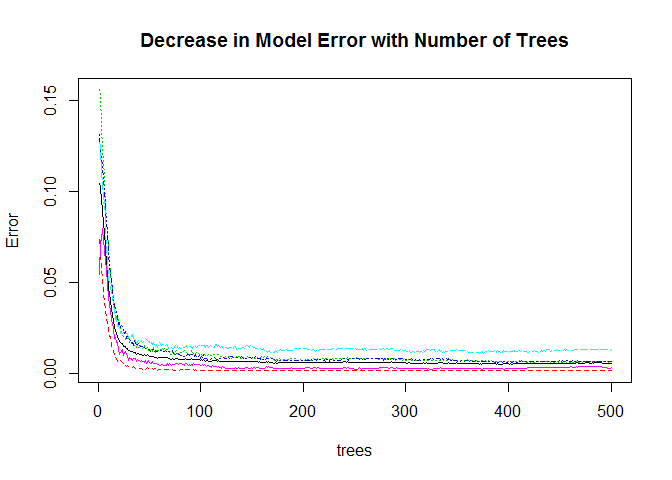
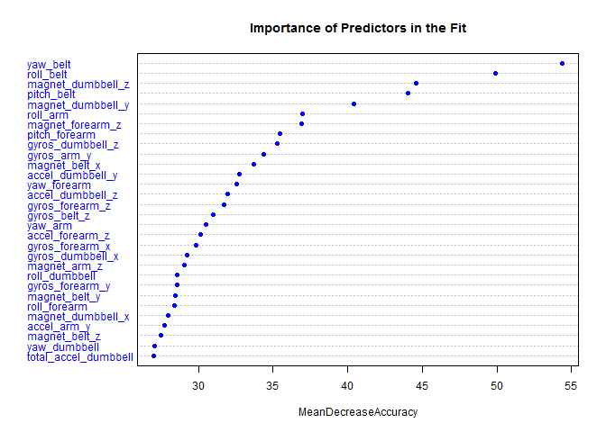

# Course Project: Classifying Weight Lifting Form
September 20, 2014  

### Synopsis
This report is a course project which uses the *Weight Lifting Exercise Dataset* from [Human Activity Recognition](http://groupware.les.inf.puc-rio.br/har) website. A random forest model is used to classify weight lifting forms from wearable accelerometers input.  The final model contains a total of 53 features with a 100% accuracy of prediction using the test dataset. 

### Data Details
The data was collected from six young health participants.  They were asked to perform one set of 10 repetitions of the Unilateral Dumbbell Biceps Curl in five different fashions: exactly according to the specification `Class A`, throwing the elbows to the front `Class B`, lifting the dumbbell only halfway `Class C`, lowering the dumbbell only halfway `Class D` and throwing the hips to the front `Class E`.

More information related to the data can be found used in the following research article:
Velloso, E.; Bulling, A.; Gellersen, H.; Ugulino, W.; Fuks, H. [Qualitative Activity Recognition of Weight Lifting Exercises](http://groupware.les.inf.puc-rio.br/work.jsf?p1=11201). Proceedings of 4th 
International Conference in Cooperation with SIGCHI (Augmented Human '13) . 
Stuttgart, Germany: ACM SIGCHI, 2013.

### Data Processing
In order to load the data without the NA, !DIV/0, and empty string values, we treated the aforementioned three types of data as NA while loading the data.  


```r
library(RCurl)
library(caret)
library(randomForest)
library(rpart.plot)
library(tree)

# read in training data
url1="https://d396qusza40orc.cloudfront.net/predmachlearn/pml-training.csv"
x1 <- getURL(url1,ssl.verifypeer = FALSE)
training <- read.csv(textConnection(x1), header = TRUE
                     , na.strings = c("NA", "#DIV/0!", "")   
                     , quote ="\"")

# read in testing data
url2="https://d396qusza40orc.cloudfront.net/predmachlearn/pml-testing.csv"
x2 <- getURL(url2,ssl.verifypeer = FALSE)
testing <- read.csv(textConnection(x2), header = TRUE
                     , na.strings = c("NA", "#DIV/0!", "")   
                     , quote ="\"")

# record data access time
dateDowloaded<-date()
dput(dateDowloaded, "dateDownloaded.txt")
```

The training data is a 19622 by 160 data set and the testing data is a 20 by 160 data set.


```r
dim(training)
```

```
## [1] 19622   160
```

```r
dim(testing)
```

```
## [1]  20 160
```

We divide the training set into `subtrain` and `subtest` data set with a 70/30 split for fitting and testing the model.


```r
inTrain <- createDataPartition(y=training$classe, p=0.7, list=FALSE)
subtrain <- training[inTrain,]
subtest <- training[-inTrain, ]
```

After using `nafunc` to check how many of the variables are missing the majority of their values (i.e. NA), we have found that a number of variables are mostly empty. 


```r
nafunc <- function(x) sum(is.na(x))
sum_nas <- sapply(subtrain, nafunc)  # number of rows in each col with NA
```

Since the variables with high number of NAs provide very little or no information, those variables are removed from the analysis.  Using 90% NAs as the cutoff point, we removed 100 variables.


```r
trainRows <- dim(subtrain)[1]
few_nas <- !(sum_nas >= 0.9*trainRows)   # TRUE = there are fewer NAs
dim(subtrain)[2]-sum(few_nas) # variables to remove
```

```
## [1] 100
```

```r
sum(few_nas) # variables to keep
```

```
## [1] 60
```

By visual inspection, we found some variables, such as the subject's name and timestamps, etc. would not have any significant impact on the outcome, thus those variables are also removed.


```r
names(subtrain)[1:7]
```

```
## [1] "X"                    "user_name"            "raw_timestamp_part_1"
## [4] "raw_timestamp_part_2" "cvtd_timestamp"       "new_window"          
## [7] "num_window"
```

```r
useful <- c(rep(TRUE, times=length(subtrain)))
useful[c(1,2,3,4,5,6,7)] <- FALSE 

keepvar <- useful & few_nas
usefulVars <- sum(keepvar)

subtrain <- subtrain[ ,keepvar]
subtest <- subtest[ ,keepvar]
```

This leaves us with 53 columns in our data, including the predicted variable.

### Model Building
Since it is a classification problem to predict the exercise type, we will use [randomForest](http://www.stat.berkeley.edu/~breiman/RandomForests/cc_home.htm#workings) algorithm. Random Forests grows many classification trees. To classify a new object from an input vector, put the input vector down each of the trees in the forest. Each tree gives a classification, and we say the tree "votes" for that class. The forest chooses the classification having the most votes (over all the trees in the forest).
 
First, we tune `randomForest` for the optimal `mtry` parameter value with respect to *Out-of-Bag* error estimate.


```r
set.seed(9988)
rf_tune <- tuneRF(subtrain[,1:(length(subtrain)-1)], subtrain$classe
                 , doBest=FALSE
                 , trace=FALSE
                 , plot=FALSE
                 )
mtry_tuned <- which.min(rf_tune)
```

The *out-of-Bag* error estimate is minimized at 5 variables. This estimate is used to create the random forest model.


```r
set.seed(138)
rf_fit <- randomForest(classe ~ . , data=subtrain
                       , mtry=mtry_tuned
                       , ntree=500
                       , importance=TRUE)
rf_fit
```

```
## 
## Call:
##  randomForest(formula = classe ~ ., data = subtrain, mtry = mtry_tuned,      ntree = 500, importance = TRUE) 
##                Type of random forest: classification
##                      Number of trees: 500
## No. of variables tried at each split: 5
## 
##         OOB estimate of  error rate: 0.55%
## Confusion matrix:
##      A    B    C    D    E class.error
## A 3900    4    1    0    1    0.001536
## B   13 2641    4    0    0    0.006396
## C    0   13 2380    3    0    0.006678
## D    0    0   27 2223    2    0.012877
## E    0    0    2    6 2517    0.003168
```

```r
# error plot
plot(rf_fit, main="Decrease in Model Error with Number of Trees")
```

 

##### *Figure 1: the model error decreases while the number of trees increases*

The graph below shows the importance of variables in the fitted model.


```r
varImpPlot(rf_fit, main = "Importance of Predictors in the Fit", 
           pch=19, col="blue",cex=0.75, sort=TRUE, type=1)
```

 

##### *Figure 2: variable importance plot*

### Cross-Validation
To validate the final model, we apply the model to the subset of the training data and compare the predicted classes to the actual classes.  


```r
pred <- predict(rf_fit,newdata=subtest)
cm <- confusionMatrix(pred,subtest$classe)
oos_err <- sum(!(pred==subtest$classe))/dim(subtest)[1] 

# estimated out of sample error
oos_err
```

```
## [1] 0.005607
```

The confusion matrix shows that the model predicts each class with high precision.  The estimated the out-of-sample error is 0.0056, or 0.5607%. 

### Test Results
The model is applied to the test cases given with the 53 selected features/variables. The predictions from this test set were submitted for the assignment. The feedback upon submission indicated that the model has a 100% accuracy. 


```r
testing <- testing[ ,keepvar]
pred2 <- predict(rf_fit,newdata=testing)

### submission file script from course website 
pml_write_files = function(x){
        n = length(x)
        for(i in 1:n){
                filename = paste0("problem_id_",i,".txt")
                write.table(x[i],file=filename,quote=FALSE,row.names=FALSE,col.names=FALSE)
        }
}

pml_write_files(pred2)
```
